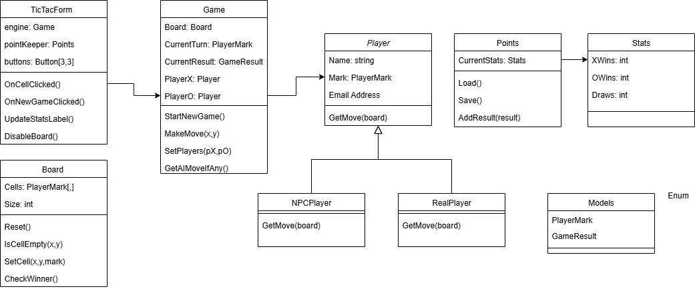

# Tre i rad - slutprojekt

**Projekt:** Tre i rad   
**Språk / plattform:** C#, Windows Forms (.NET 8)  
**Författare:** *Sami*  
**Datum:** *2025-10-07*

---

## Kort beskrivning 
Tre i rad är ett spel på ett 3×3-bräde där två spelare turas om att placera X och O. 
Den som först får tre i rad (horisontellt, vertikalt eller diagonalt) vinner. Om brädet fylls utan vinnare blir det oavgjort. 

Spelet erbjuder:

- Spelare vs spelare på samma dator
- Spelare vs NPC (dator), enkel AI som väljer första lediga ruta, 
(default, man kan radera/ kommentera ut kod för att de ska bli spelare vs spelare, det hänvisas i koden och visar vart genom kod kommentarerna i TikTacForm.cs filen).
- Statistik (antal vinster för X, O och oavgjorda) som sparas i en JSON-fil i `%AppData%/TicTacToeE/stats.json`.
- GUI byggd med Windows Forms (9 knappar för rutorna, status- och statistiklabels, New Game-knapp).

---

## Hur spelet är byggt
Projektet är uppdelat i separata klasser med klart ansvar (Single Responsibility):

- `TicTacForm` (`Form`)
  - Ansvar: GUI, hantera klick, uppdatera labels, starta nytt spel.
- `Game`
  - Ansvar: spelmotor — turordning, validera drag, avgöra vinnare.
  - Innehåller `Board` och referenser till `PlayerX` och `PlayerO`.
- `Board`
  - Ansvar: representera brädet (`PlayerMark[,] Cells`), reset, kontrollera vinnare.
- `Player` (abstrakt) — basklass 
  - `RealPlayer` (subklass)
  - `NPCPlayer` (subklass, enkel AI: väljer första tomma ruta)
  - Ansvar: i framtiden kan `GetMove(board)` användas för polymorfa drag.
- `Points` / `Stats`
  - Ansvar: läsa/spara statistik till JSON-fil.

### Kort flöde
1. Program startar `TicTacForm`.
2. `TicTacForm` initierar `Game` och `Points`.
3. Spelaren klickar en ruta --> `OnCellClicked` anropar `Game.MakeMove(x,y)`.
4. UI uppdateras. Om NPC är aktiv kallar formuläret `Game.GetAIMoveIfAny()` och kör NPC:s drag.
5. Vid game over uppdateras `Points` och sparas till fil.

---

## Tekniker och bibliotek
- C# (.NET 8)
- Windows Forms (System.Windows.Forms)
- JSON-serialisering: `System.Text.Json`
- Filplacering: `%AppData%/TicTacToeE/stats.json`
- UML: Bilaga se längst ner.

---

## Några problem och lösningar 
**Problem:** Dubbletter av kontroller och överlappande knappar (orsak: både designer och dynamisk skapelse av knappar).  
**Lösning:** Använd en metod: antingen skapa knappar dynamiskt i kod **eller** använd designer-kontroller och mappa dem till en array. I detta repot används designer-kontroller (button1..button9) och de mappas i konstruktorn.

**Problem:** Saknade event-handler-metoder (kompileringsfel).  
**Lösning:** Antingen lägga till stub-metoder i `TicTacForm.cs` eller ta bort felaktiga `Click +=` i designer-filen. I projektet binds Click-handlers i konstruktorn.

**Problem:** Vill visa arv i projektet.  
**Lösning:** Implementerad `Player`-hierarki (`Player` abstrakt → `RealPlayer`, `NPCPlayer`) och `Game` använder `SetPlayers(...)` för att injicera spelartyper.

---

## Hur du kör projektet
1. Öppna projektet i Visual Studio.
2. Bygg lösningen (Ctrl+Shift+B).
3. Kör (F5). Fönstret visar 3×3-knappar, `Turn:` label och `New Game`-knapp.
4. Klicka i en ruta för att göra ett drag. Vid NPC-inställning gör datorn sitt drag automatiskt.
5. Statistik uppdateras och sparas automatiskt vid spelavslut.

---

